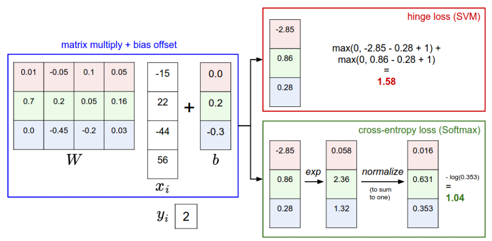

# Assigment
Details about this assignment can be found [on the course webpage](http://cs231n.github.io/), under Assignment #1 of Spring 2021`.

2021 cs231n作业  
Course: https://cs231n.github.io/

Code Download: https://cs231n.github.io/assignments/2021/assignment1_colab.zip

Enviorment:Google colab

---

## Assigment 1

### KNN
question : 完成KNN分类器。

课程文档：https://cs231n.github.io/classification/

思想：该点与其他点的欧式距离，最近的K个点那类最多，就把该点分为那类。

**欧式距离（二范数）L2**
$$L_p(x_i,x_j)=(\sum_{l=1}^n|x_i^{(l)}-x_j^{(l)}|^2)^\frac{1}{2}$$

**超参数（Hyperparameter tuning）：K**
> **trick：** 我们不能使用测试集来调整超参数。将训练集分成两部分，将较小部分称为验证集。这个验证集本质上被用作一个假测试集来调整超参数。

**交叉验证**

在训练数据很小的情况下。（计算成本高）
K折交叉验证，初始采样分割成K个子样本，一个单独的子样本被保留作为验证模型的数据，其他K-1个样本用来训练。交叉验证重复K次，每个子样本验证一次，平均K次的结果或者使用其它结合方式，最终得到一个单一估测。这个方法的优势在于，同时重复运用随机产生的子样本进行训练和验证，每次的结果验证一次。

#### **遇到的问题**
1. **enumerate()函数**
   
  enumerate() 函数用于将一个可遍历的数据对象(如列表、元组或字符串)组合为一个索引序列，同时列出数据和数据下标，一般用在 for 循环当中。
  ```python
      >>> seq = ['one', 'two', 'three']
      >>> for i, element in enumerate(seq):
      ...     print i, element
      ...
      0 one
      1 two
      2 three
  ```
2. **np.reshape()函数**
   
    1）. numpy.arange(n).reshape(a, b) 依次生成n个自然数，并且以a行b列的数组形式显示
    > 注意：reshape(m,-1) || reshape(-1,m)  -1作用表示：自动计算列/行，d=a*b/m
    ```python
    >>>>a = np.arange(6).reshape((3, 2))
    >>>>a
    array([[0, 1],
       [2, 3],
       [4, 5]])
    #############
    >>>>np.reshape(a, (2, 3)) 
    array([[0, 1, 2],
       [3, 4, 5]])
    #############
    >>>>np.reshape(a, (3, -1)) 
    array([[0,1],
        [2,3],
        [4,5]]
    ```

3. **np.argsort函数**
   > numpy.argsort(a, axis=-1, kind=’quicksort’, order=None)
   功能: 将矩阵a按照axis排序，并返回排序后的下标
   ```python
   closest_y=self.y_train[np.argsort(dists[i])[0:k]]#取dists中k个最小值，得到y_train
   ```

4. **np.bincount()函数**
    ```python
    x = np.array([0, 1, 1, 3, 2, 1, 7])
    # 索引0出现了1次，索引1出现了3次......索引5出现了0次......
    np.bincount(x)
    #因此，输出结果为：array([1, 3, 1, 1, 0, 0, 0, 1])
    ```

5. **python中的数组、列表、元组与字典** 
* **数组**：存储同一种数据类型的集合。
  * 声明 一维：np.array([2,3,4]) || 多维 np.array([2,3,4],[5,6,7])
    ```python
        a = np.array([[1,2,3,4],[5,6,7,8]])  #二维数组
        print(a.shape[0])  #值为2，最外层矩阵有2个元素，2个元素还是矩阵。
        print(a.shape[1])  #值为4，内层矩阵有4个元素。
        print(a.shape[2])  #IndexError: tuple index out of range
    ```
* **列表**：可以存储任意数据的集合
  * 声明： list = []
  * 列表可以嵌套列表
  * 列表添加新值：append()函数
  * 列表的数据项不需要有相同的类型
  * 切片
    * list [::-1]   #列表的翻转
    * list[1:]      #除了第一个元素之外的其他元素
    * list[:-1]     #除了最后一个元素之外的其他元素
* **字典**
  * **空字典**：dict = {}
  * **一维**： dict = {key1 : value1, key2 : value2 }
  * **多维**： dict = {key1 : {key1 : value1, key2 : value2 }, key2 : value2 }
  * **键必须是唯一的，但值则不必。**
* **元组**
  * **声明空元组** tup1=()
  * 元组的元素不能修改。


6. **axis参数**

  一般在使用numpy库时，会经常用到axis参数。

  axis定轴，即axis=0时，可以简单的认为以列为轴。 axis=1时，认为以行为轴（axis的重点在于方向，而不是行和列）

  在python序列中，正索引是从0到length-1， 而负索引则是从-1到-length。
  数组中有几维即有几个轴。

---
### SVM classifier && Softmax classifier 

**question**:实现svm和softmax分类器

**课程文档**:https://cs231n.github.io/linear-classify/

**KNN存在的问题：**
* 分类器必须记住所有的训练数据，并将其存储起来，以便将来与测试数据进行比较。这是空间效率低下的，因为数据集的大小可能很容易达到gb。
* 分类测试图像是昂贵的，因为它需要与所有训练图像进行比较。

#### SVM

$$\hat{y}=Wx+b$$

**Bias trick**:将b扩展到w中。即w增加一个维度数值为b，相应的在xi中新增一维度，且该维数值为常量1。

计算**hinge loss(max margin) margin**，以及正则化项：
$$L_i =\sum_{j\neq{i}}\max(\hat{y}-y_i+1,0)(损失函数)$$
**注**：这个式子中只有错误的分类才会产生loss，即j=i正确分类是没有loss的。

$$L=\frac{1}{N}\sum_i L_i+\lambda\sum_k{W^2_k}(加入正则项)$$


SVM损失函数想要SVM在正确分类上的比分始终比不正确的比分高出一个边界值$\triangle$。
**导数的计算：**
$$maxmargin=(x_iw_j-x_iw_{y_i}+\triangle)$$
$$\begin{cases}dW=-(\sum_{j\neq{i}}(maxmargin>0)x_i & j = i\\dW=(maxmargin>0)x_i & j \neq{i}\end{cases}$$


每个大于0的maxmargin会产生两个贡献：对于正确分类产生$-x_i$贡献，错误分类则产生一个$x_i$贡献。

#### **遇到的问题**
1. **有关array.shape的问题**

    X.shape——(500,3073)
    X[0]为第一行——所有元素——3073个
    X[:,0]为第一列——shape——(500,)

2. **lambda**
  
  lambda 函数是一种小的匿名函数。

  lambda 函数可接受任意数量的参数，但只能有一个表达式。
  **语法**
  ```python
    lambda arguments : expression
      
    x = lambda a, b : a * b
    printx(5, 6))
    >>>30
  ```
3. **np.mean(x == y)**
  1）判断x与y对应的值是否相等

  2）然后对其求平均值，即在此处是计算自己训练出来的模型的准确率的
  ```python
    x = np.array([1, 0, 1, 1, 1, 1])
    y = np.array([0, 0, 0, 0, 0, 1])
    print(x==y)
    [False True False False False True]
    print("{:.2f}".format(np.mean(x == y)))
    结果：
    0.33=2/6 #2个True/总数6 sum 
   
  ```
#### SoftMax

**softmax function**:
$$f_j(z)=\frac{e^zj}{\sum_{k}{e^zk}}$$

softmax function取一个任意实值分数的向量(在z中)，并将其压缩为一个值在0到1之间的向量，其和为1。
e的指数数值特别大，一般利用减去最大值使其余的值均小于0。此时exp(x)的值仅在(0,1]之间。

**证明**:
$${\frac{e^{f_{y_i}}}{\sum_je^{f_j}}}={\frac{Ce^{f_{y_i}}}{C\sum_je^{f_j}}}={\frac{e^{f_{y_i}+\log_{}{C}}}{\sum_je^{f_j+\log_{}{C}}}}$$

一般利用$\log_{}{C}=-max_jf_j$计算。

思想与svm类似，但是输出的不是得分，而是输出归一化的类概率。损失函数用交叉熵损失代替hinge loss

**交叉熵损失函数**：
$$L_i=-\log(_{}{\frac{e^{f_{y_i}}}{\sum_je^{f_j}}})$$  

or 

$$L_i=-f_{y_i}+\log_{}{\sum_je^{f_j}}$$

$f_j$表示分类分数向量f的第j个元素

**导数**：
$$\begin{cases}dW=(-1+\frac{e^{f_j}}{\sum_{j}{e^{f_j}}}) & j = i\\dW=\frac{e^{f_j}}{\sum_{j}{e^{f_j}}}x_i& j \neq{i}\end{cases}$$

**SVM VS Softmax**


### Two layer neural network

  Linear score function $f=Wx$

  2-layer Neural Network $f=W_2max(0,W_1x)$

  3-layer Neural Network $f=W_3max(0,W_2max(0,W_1x))$


**numpy.linspace(start,end,num=num_points)函数用于在线性空间中以均匀步长生成数字序列。**
Numpy通常可以使用numpy.arange()生成序列，但是当我们使用浮点参数时，可能会导致精度损失，这可能会导致不可预测的输出。为了避免由于浮点精度而造成的任何精度损失，numpy在numpy.linspace()为我们提供了一个单独的序列生成器，如果您已经知道所需的元素数，则这是首选。 但是通常使用带有适当参数的linspace()和 arange()可以得到相同的输出，因此可以为同一任务选择两者。

``` python
x = np.linspace(-0.1, 0.5, num=input_size).reshape(num_inputs, *input_shape)
```

对于两个矩阵相乘的话，在反向传播时反正是另外一个项与传播过来的梯度项相乘。差别就在于位置以及翻转。（小窍门:就是最后计算出梯度肯定要与原来的矩阵是同样的shape。）