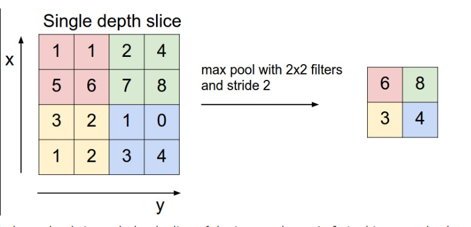
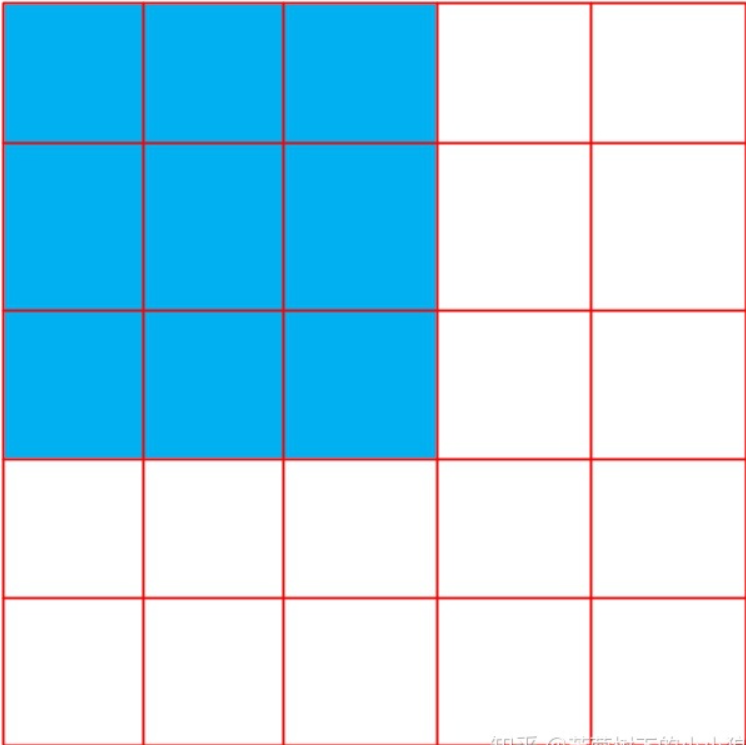
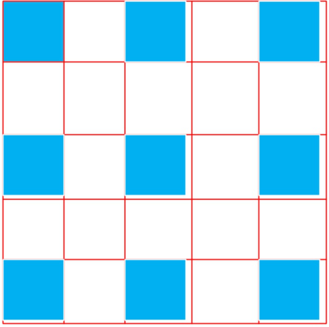

# Assigment
Details about this assignment can be found [on the course webpage](http://cs231n.github.io/), under Assignment #1 of Spring 2021`.

2021 cs231n作业  

Course: https://cs231n.github.io/

Code Download: https://cs231n.github.io/assignments/2021/assignment2_colab.zip

Enviorment:Google colab

---

## Assigment 2

### Fully Connected Nets

**affine_forward, affine_backward, relu_forward, relu_backward、softmax_loss**可以用assignment1中的实现。


**权重初始化**

神经网络使用误差反向传播算法（梯度下降）来训练，其需要从输出向输入逐层求导，根据导数（梯度）来更新权重，然后继续下一轮迭代。如果求出的导数（梯度）过小，那么权重的更新幅度会很小，学习速度就会变慢，甚至无法收敛。训练之前需要给神经网络的权重赋初始值，初始值的选择会对导数有很大影响。

**SGD+Momentum**
[http://cs231n.github.io/neural-networks-3/#sgd]

为解决传统的梯度下降算法收敛很慢的问题。

$$v_i=\gamma v_{i-1}-\eta\triangledown{L(\theta)}$$


$\gamma$是动量参数，是一个小于1的正数，

如果这一时刻更新度 vt与上一时刻更新度 vt−1的方向相同，则会加速。反之，则会减速。加动量的优势有两点：
1. 加速收敛
2. 提高精度(减少收敛过程中的振荡)


相当于每次在进行参数更新的时候，都会将之前的速度考虑进来，每个参数在各方向上的移动幅度不仅取决于当前的梯度，还取决于过去各个梯度在各个方向上是否一致，如果一个梯度一直沿着当前方向进行更新（水平方向），那么每次更新的幅度就越来越大，如果一个梯度在一个方向上不断变化（竖直方向），那么其更新幅度就会被衰减，这样我们就可以使用一个较大的学习率，使得收敛更快，同时梯度比较大的方向就会因为动量的关系每次更新的幅度减少。


**RMSProp**
迭代公式

$$s_1=\beta_1s_1+(1-\beta_1)dw_1^2$$

$$s_2=\beta_2s_2+(1-\beta_2)dw_2^2$$

$$w_1=w_1-\alpha\frac{dw_1}{\sqrt{s_1+\epsilon}}$$

$$w_2=w_2-\alpha\frac{dw_2}{\sqrt{s_2+\epsilon}}$$

s对梯度的平方做了一次平滑。更新w时，先用梯度除以$\sqrt{s_1+\epsilon}$相当于对梯度做了一次归一化。

合并上式

$$s=\beta s+(1-\beta)dw^2$$

$$w=w-\alpha\frac{dw}{\sqrt{s+\epsilon}}$$

$\epsilon$为很小的数，一般设置为$10^{-8}$ 避免除0。$\beta$为超参，一般设置为0.999

**Adam**
迭代公式

$$v=\beta_1v+(1-beta_1)dw$$

$$s=\beta_2s+(1-beta_2)dw^2$$

$$w=w-\alpha\frac{v}{\sqrt{s+\epsilon}}$$

$\beta_1$一般设为0.9,$\beta_2$一般设置为0.999

### BatchNormalization
**batchnorm** 归一化
归一化可以避免梯度消失。

**mini-batch-mean**

$$\mu_\beta\leftarrow\frac{1}{m}\sum_{i=1}^mx_i$$  

**mini-batch-variance**
$$\sigma_\beta\leftarrow\frac{1}{m}\sum_{i=1}^m(x_i-\mu_\beta)^2$$


$x：$批输入数据
$m:$当前批输入数据大小

归一化公式

$$\hat{x}_i\leftarrow\frac{x_i-\mu_\beta}{\sqrt{\sigma_{\beta}^2+\epsilon}}$$
normalize

$$y_i\leftarrow\gamma\hat{x}_i+\beta$$
scale-and-shift

$\epsilon:$添加较小的值到方差以防止除零

$\gamma:$可训练的比例参数

$\beta：$可训练的偏差参数


BN，它沿着BatchSize这个维度做normalize，在CV模型的表现就很好，但到了NLP模型，由于BatchSize一般都较小，如果还是用BN，那效果就不好了，反之，由于channel（HiddenSize）维度很大，用LN(layernorm)的效果会很好。

**BN Backward**[https://blog.csdn.net/yuechuen/article/details/71502503] 

### Dropout

https://cs231n.github.io/neural-networks-2/#reg

当训练一个深度神经网络时，随机丢弃一些神经元，来避免过拟合。神经元的丢弃是随机的，可设定一个概率p，即每个神经元以p的概率丢弃。

采用了Dropout的网络计算公式：

$$r_j^{(l)}\sim Bernoulli(p)$$

$$\tilde{y}^{(l)}=r^{(l)}*y^{(l)}$$

$$z_i^{(l+1)}=w_i^{(l+1)}\tilde{y}^{(l)}+b_i^{(l+1)}$$

$$y_i^(l+1)=f(z_i^{l+1})$$

Bernoulli是概率p的伯努利分布，取值为0或1，即该分布中的每一个元素取值为0的概率是p，$y^{(l)}$表示第l个全连接层，x是特征向量。

第l层的神经元的值乘上概率为p的Bernoulli分布，即以p概率将神经随机置0。

在train阶段，dropout的本质通过在学习过程中随机删除神经元，从而每一次都让不同的模型进行学习。

在测试时，所有的神经元都是可以激活的，这会造成训练和测试时网络的输出不一致，所以要在测试的时候让每个模型投票来得到结果。

比如，训练的时候，10个神经元置中6个置为0(p=0.6，相当于训练时随机删除了6个神经元，只有4个神经元在工作)，测试的时候是用10个神经元来投票，那么每个神经元的权重是0.4(1 − p = 0.4)，操作的方法是将dropout层这10个神经元的值加起来乘以0.4，即每个神经元的值都乘以0.4。

对于一个神经网络层$y=f(W\cdot X+b)$,引入一个掩蔽函数mask，使得$y=f(W\cdot mask(X)+b$,设神经元废弃率为p,则掩蔽函数mask可表示为：

训练时
$$mask(X)=Bernoulli(p)*X$$ 

测试时
$$mask(X)=(1-p)*X$$ 

### ConvolutionalNetwork

https://cs231n.github.io/convolutional-networks/

1. **np.pad()函数**

```
pad(array, pad_width, mode, **kwargs)
返回值：数组

array——表示需要填充的数组；

pad_width——表示每个轴（axis）边缘需要填充的数值数目。
参数输入方式为：（(before_1, after_1), … (before_N, after_N)）,
其中(before_1, after_1)表示第1轴两边缘分别填充before_1个和after_1个数值。
取值为：{sequence, array_like, int}

mode——表示填充的方式（取值：str字符串或用户提供的函数）,总共有11种填充模式；
"constant"——表示连续填充相同的值，每个轴可以分别指定填充值，constant_values=（x, y）时前面用x填充，后面用y填充，缺省值填充0
"edge"——表示用边缘值填充

"linear_ramp"——表示用边缘递减的方式填充

"maximum"——表示最大值填充

"mean"——表示均值填充

"median"——表示中位数填充

"minimum"——表示最小值填充

"reflect"——表示对称填充

"symmetric"——表示对称填充

"wrap"——表示用原数组后面的值填充前面，前面的值填充后面
```

填充(padding)的情况下:需要判断H,W，在stride下会不会丢失信息。即判断H,W能不能被stride整除
$$(H+2*pad-f)\%stride==0$$
$$(W+2*pad-f)\%stride==0$$

* H,W为输入图片大小；
* f为卷积核大小；
* pad为填充大小；
* s为步长大小；

卷积之后的图片输出大小公式为
$$out=\lfloor \frac{H+2*pad-f}{s} \rfloor+1$$

**池化层反向传播**



以最大池化举例，池化后的数字6对应于池化前的红色区域，实际上只有红色区域中最大值数字6对池化后的结果有影响，权重为1，而其它的数字对池化后的结果影响都为0。假设池化后数字6的位置delta误差为$\delta$，误差反向传播回去时，红色区域中最大值对应的位置delta误差即等于$\delta$  ，而其它3个位置对应的delta误差为0。

因此，在卷积神经网络最大池化前向传播时，不仅要记录区域的最大值，同时也要记录下来区域最大值的位置，方便delta误差的反向传播。

平均池化时，区域中每个值对池化后结果贡献的权重都为区域大小的倒数，所以delta误差反向传播回来时，在区域每个位置的delta误差都为池化后delta误差除以区域的大小。

**卷积层反向传播**

https://www.cnblogs.com/pinard/p/6494810.html


### Pytorch
```python
x.requires_grad == True 
```

这段代码的作用是让 backward 可以追踪这个参数并且计算它的梯度(计算图)。最开始定义你的输入是requires_grad=True ，那么后续对应的输出也自动具有 requires_grad=True(输出也需要保存相关梯度信息，这样就保证了这个输入的梯度回传)


**torch.nn 中的 Convolution Layers**

```python
torch.nn.Conv2d(in_channels, out_channels, kernel_size, 
            stride=1, padding=0,  groups=1, bias=True, 
            padding_mode='zeros', device=None, dtype=None)
```
Conv2d实现2d卷积操作。

**参数**
* in_channels —— 输入的channels数

* out_channels —— 输出的channels数

* kernel_size ——卷积核的尺寸，可以是方形卷积核、也可以不是。

* stride —— 步长，用来控制卷积核移动间隔

* padding ——输入边沿扩边操作

* groups —— 组控制输入和输出之间的连接。In_channels和out_channels必须都能被组整除
  * groups =  1，所有输入卷积到所有输出 
  * groups =  2，该操作相当于并排拥有两个转换器层，每个转换器层看到一半的输入通道，产生一半的输出通道，然后两者连接起来
  * groups= in_channels，每个输入通道都与自己的一组过滤器($size = \frac{out_channels}{in_channels}$)进行卷积

* bias ——是否使用偏置

* padding_mode ——扩边的方式,默认为: 'zeros'

* dilation —— 这个参数简单说，设定了取数之间的间隔
  * dilation = 1

  * dilation = 2



上图中蓝色为选取进行卷积计算的值。


**nn.Sequential——序列模型实现**

一个有序的容器，神经网络模块将按照在传入构造器的顺序依次被添加到计算图中执行，同时以神经网络模块为元素的有序字典也可以作为传入参数。

```python
model = nn.Sequential(
            nn.Conv2d(1,20,5),
            nn.ReLU(),
            nn.Conv2d(20,64,5),
            nn.ReLU()
        )
# result        
Sequential(
  (0): Conv2d(1, 20, kernel_size=(5, 5), stride=(1, 1))
  (1): ReLU()
  (2): Conv2d(20, 64, kernel_size=(5, 5), stride=(1, 1))
  (3): ReLU()
)
```

**nn.Module**

序列模型实现可以直接使用nn.Sequential，但是对于复杂模型，比如：多输入多输出、多分支模型、跨层连接模型、带有自定义层的模型等。就需要自己来定义一个模型了。Sequential类也是继承自Module类的。


```python
class Module(object):
    def __init__(self):
    def forward(self, *input):

    def add_module(self, name, module):
    def cuda(self, device=None):
    def cpu(self):
    def __call__(self, *input, **kwargs):
    def parameters(self, recurse=True):
    def named_parameters(self, prefix='', recurse=True):
    def children(self):
    def named_children(self):
    def modules(self):  
    def named_modules(self, memo=None, prefix=''):
    def train(self, mode=True):
    def eval(self):
    def zero_grad(self):
    def __repr__(self):
    ...
```

我们在定义自已的网络的时候，需要继承nn.Module类，并重新实现构造函数__init__构造函数和forward这两个方法。


注意技巧:
* 一般把网络中具有可学习参数的层（如全连接层、卷积层等）放在构造函数__init__()中。

* 一般把不具有可学习参数的层(如ReLU、dropout、BatchNormanation层)可放在构造函数中，也可不放在构造函数中，如果不放在构造函数__init__里面，则在forward方法里面可以使用nn.functional来代替。

* forward方法是必须要重写的，它是实现模型的功能，实现各个层之间的连接关系的核心。